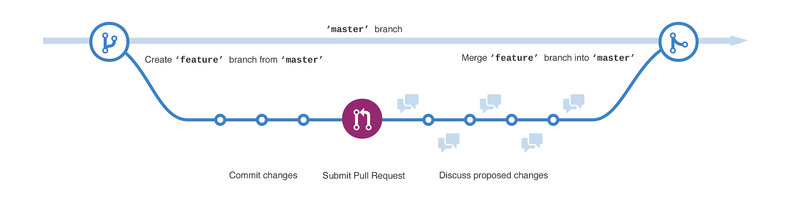

# Arco

<p align="center">
  
</p>


Este repositório nasce como um esqueleto técnico para materializar, em código, uma visão mais ampla de plataforma de dados. O objetivo é evoluir para uma arquitetura orientada a contratos, com foco em qualidade, ownership bem definido, observabilidade, governança e práticas de FinOps, mantendo a simplicidade operacional como princípio central.

A base de desenvolvimento é fortemente apoiada em boas práticas de engenharia de software, como orientação a objetos, princípios SOLID, KISS, testes automatizados e documentação consistente. Além disso, prioriza-se um pensamento crítico e analítico sobre cada implementação, garantindo decisões técnicas mais sustentáveis, escaláveis e alinhadas ao longo prazo.

## Introducao

A proposta deste projeto e servir como fundacao para componentes de uma plataforma
de dados: ingestao, validacao, transformacao, contratos, observabilidade,
orquestracao e automacao de rotinas. O objetivo inicial nao e maximizar
complexidade, mas criar uma base limpa para desenvolver com disciplina tecnica.


O projeto usa:

- `uv` para gerenciamento de ambiente, dependencias e execucao de comandos.
- `Makefile` para padronizar comandos locais.
- `pyproject.toml` como fonte central de configuracao Python.
- `ruff` para lint e formatacao.
- `pytest` para testes.
- `mypy` para checagem estatica de tipos.
- `pre-commit` para validacoes antes de cada commit.
- `CHANGELOG.md` para registrar a evolucao do projeto.

## Proposta

Este repositorio deve ajudar a demonstrar uma abordagem pragmatica de engenharia
para Data Platform:

- Codigo pequeno, legivel e bem separado por responsabilidade.
- Contratos explicitos entre camadas, dados e interfaces.
- Testes automatizados desde os primeiros fluxos.
- Configuracao reproduzivel para qualquer pessoa rodar localmente.
- Automacao de qualidade antes de abrir pull requests.
- Decisoes tecnicas simples, registradas e faceis de revisar.
- Foco em melhores práticas (SOLID, OOP, Clean Code, Tests, Docstrings, KISS, Design Patterns)

No contexto do case, a implementacao deve caminhar para um pequeno framework de
plataforma capaz de padronizar a criacao e operacao de pipelines. A intencao e
que cada dataset critico deixe de ser apenas uma tabela ou uma DAG isolada e passe
a ter um contrato operacional claro.

## Contexto do Case

A solucao proposta combina uma arquitetura medallion com praticas de Data Mesh:

- `Landing`: preserva o payload original para rastreabilidade, auditoria e
  reprocessamento.
- `Raw`: padroniza tecnicamente os dados, aplica validacoes estruturais, metadados
  de ingestao, nomenclatura, hash, colunas de auditoria e mapeamentos.
- `Curated`: disponibiliza entidades, fatos e agregados certificados para consumo
  analitico e operacional.

A camada `curated` deve ser tratada como a camada de produtos de dados
certificados. Tabelas criticas precisam ter descricao funcional, ownership,
lineage, frequencia de atualizacao, classificacao de sensibilidade e indicacao
clara de uso recomendado.

## Arquitetura

A estrutura inicial foi criada para separar o nucleo da plataforma, utilitarios,
integracoes externas e testes. Os arquivos Python nascem como stubs para evolucao
incremental da implementacao.

Resumo das responsabilidades:

- `.github` concentra metadados de colaboracao, como owners e template de pull request.
- `src/config` guarda configuracoes base do projeto.
- `src/core` concentra os fluxos principais de ingestao, transformacao e machine learning.
- `src/core/ingestao/connectores` organiza conectores por tipo de origem ou transporte.
- `src/core/ingestao/contexto` guarda objetos de contexto para parametrizar execucoes.
- `src/utils/common` reune utilitarios compartilhados, enums, excecoes e helpers.
- `src/utils/integracoes` isola clientes e adaptadores para ferramentas externas.
- `src/utils/servicos` agrupa servicos transversais como qualidade, metadata, ACL, FinOps e monitoramento.
- `test` separa suporte de banco, helpers, testes unitarios e testes de integracao.

Padrao para imagens no README:

- Guarde imagens de documentacao em `docs/assets/readme/`.
- Use nomes curtos, em minusculo e separados por hifen.
- Referencie sempre por caminho relativo para funcionar no GitHub e localmente.

## Exemplo de Pipeline YAML

Um Dataset pode ser descrito de forma declarativa em YAML. Nesse modelo, o bloco
`Dag` define o contexto geral da DAG e cada item em `dataset` representa uma
entidade de origem que sera processada por um conector especifico.

Esqueleto>

```yaml
Dag:
  dag_id: ""
  dag_name: ""
  escopo: "ingestao"
  dominio: ""
  agendamento: " * * * * *"
  source_system: ""
  dataset:
    - name: ""
      connector: "restapi"
      source_entity: ""
      owner_team: ""
      credencial_id: ""
      metodo: ""
      base_url: ""
      schema: !include ../dataset/...
      sync: !include ../dataset/...
      observabilidade: !include ../dataset/...
      qualidade: !include ../dataset/...
```

Leitura pela arquitetura:

- `escopo`, `dominio`, `agendamento` e `source_system` alimentam o contexto do pipeline em `src/core/ingestao/contexto`.
- `connector: "restapi"` direciona a execucao para os conectores em `src/core/ingestao/connectores/api`.
- `schema`, `sync`, `observabilidade` e `qualidade` se conectam aos servicos em `src/utils/servicos`.
- `credencial_id`, `metodo`, `base_url` representam parametros tecnicos da integracao externa de cada connector.

## Quickstart

Pre-requisitos:

- Python `3.12+`
- `uv` instalado
- `make` disponivel no ambiente

Instale o `uv`, caso ainda nao tenha:

```bash
curl -LsSf https://astral.sh/uv/install.sh | sh
```

Configure o projeto:

```bash
make install-dev
make pre-commit-install
```

Rode as validacoes locais:

```bash
make check
```

Execute comandos Python dentro do ambiente gerenciado pelo `uv`:

```bash
uv run python
```

## Comandos

Os principais comandos ficam centralizados no `Makefile`:

```bash
make help                 # Lista os comandos disponiveis
make install              # Sincroniza dependencias principais
make install-dev          # Sincroniza dependencias de desenvolvimento
make lock                 # Atualiza o lockfile do uv
make lint                 # Executa lint com Ruff
make format               # Formata o projeto com Ruff
make typecheck            # Executa checagem de tipos com mypy
make test                 # Executa testes
make test-cov             # Executa testes com cobertura
make check                # Executa lint, typecheck e testes
make pre-commit-install   # Instala hooks de pre-commit
make pre-commit-run       # Executa hooks em todos os arquivos
make clean                # Remove caches locais
```

## Testes

O padrao de testes e `pytest`.

Sugestao de organizacao:

- Testes unitarios para regras puras, validadores, contratos e transformacoes.
- Testes de integracao para adapters, storage, APIs e dependencias externas.
- Fixtures pequenas, explicitas e proximas do comportamento testado.
- Dados de teste anonimizados e pequenos.

Para rodar:

```bash
make test
```

Com cobertura:

```bash
make test-cov
```

## Padroes de Projeto

Padroes iniciais adotados:

- Python `3.12+`.
- Pytest + Unity Test
- Tipagem explicita em funcoes publicas.
- Formatacao automatica com `ruff format`.
- Lint com regras de qualidade, imports, modernizacao e bugs comuns.
- Nomes claros para modulos, funcoes e casos de uso.
- Funcoes pequenas e orientadas a comportamento.
- Dependencias externas isoladas atras de adapters.
- Erros de dominio representados de forma explicita.
- Commits pequenos e revisaveis.

Evite:

- Logica de negocio dentro de clientes de infraestrutura.
- Acoplamento direto entre jobs e detalhes de storage/API.
- Configuracao sensivel versionada.
- Testes que dependem de ordem, horario real ou ambiente externo sem controle.
- Abstracoes criadas antes de existir repeticao ou necessidade real.

## Qualidade

Antes de abrir uma mudanca, rode:

```bash
make check
make pre-commit-run
```

O pre-commit executa validacoes basicas de arquivos e Ruff. A configuracao esta
em `.pre-commit-config.yaml`.

## Contribuicao

Este projeto segue o GitHub Flow: toda mudanca nasce em uma branch curta a partir
da `main`, recebe commits pequenos, passa por pull request e so entra na branch
principal depois de revisao e validacao.

<p align="center">
  
</p>

Fluxo sugerido:

1. Crie uma branch curta e descritiva utilizando a metodologia do GitHub Flow.
2. Sincronize o ambiente com `make install-dev`.
3. Implemente uma mudanca pequena e coesa.
4. Adicione ou ajuste testes.
5. Rode `make check`.
6. Atualize o `CHANGELOG.md` quando houver mudanca relevante.
7. Abra o pull request com contexto, decisao tecnica e evidencias de teste.

## Changelog

Mudancas relevantes devem ser registradas no `CHANGELOG.md`, seguindo uma versao
simples do formato Keep a Changelog:

- `Added` para novas capacidades.
- `Changed` para alteracoes em comportamento existente.
- `Deprecated` para funcionalidades que serao removidas.
- `Removed` para remocoes.
- `Fixed` para correcoes.
- `Security` para correcoes de seguranca.
